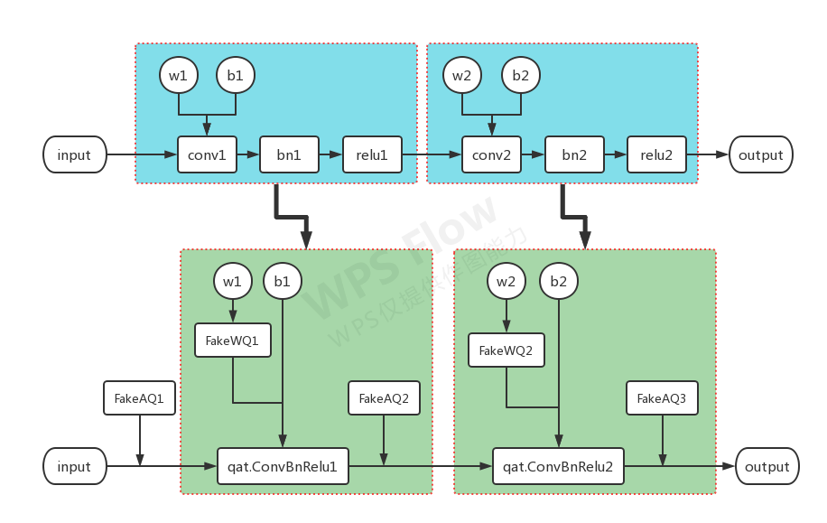

# MQBench (https://github.com/ModelTC/MQBench)

## 基本简介
---
来自商汤的ModelTC(模型工具链团队?)

依赖与Pytorch的fx，所以需要Pytorch 1.8+

提供统一且SOTA的理论算法和量化策略，以及自动节点插入

理想是
- 支持各种可部署的量化算法(LSQ，LSQ+，DSQ，PACT，DoReFa-Net...)
- 丰富的硬件后端库(TensorRT，SNPE，TVM，OpenVino，Tengine...)

新增量化算法和硬件后端都可以用插件式接入，改动较少

文档较少且代码水平比较高，学习需要较多的时间[mqbench documentation](http://mqbench.tech/assets/docs/html/)

依赖自动追踪，不支持类似mm系列的class模型构建方式(有人修改支持，但是以及本质上改动了mm的构建模式)


## 使用和代码分析
---

**插入量化信息和节点**

[prepare_by_platform](https://github.com/ModelTC/MQBench/blob/78e6051c8d5f251b7f6ada562d05706a9732a3c5/mqbench/prepare_by_platform.py#L294)

离线目录：mqbench->prepare_by_platform.py #line 294

1、qconfig = get_qconfig_by_platform 获取量化方案，权重量化，激活量化，权重观测，激活观测

2、_swap_ff_with_fxff 替换fx不支持的节点 torch.nn.quantized.FloatFunctional <- torch.nn.quantized.FXFloatFunctional()
- add
- cat
- mul
- add_relu
- add_scalar
- mul_scalar

3、如果有需要保留的属性则进行原始属性备份

4、CustomedTracer 符号追踪，继承于torch.fx->Tracer，重写了is_leaf_module

5、调用tracer.trace进行符号追踪调用

6、graph_module = GraphModule(model, graph, name) 将追踪得到的流图构建为新的module

7、调用mqbench->custom_quantizer->model_quantizer.py #line 62 prepare 进行预处理操作 [prepare](https://github.com/ModelTC/MQBench/blob/32a70a2d8c42b730ceb11a5af4723473dee55dd9/mqbench/custom_quantizer/model_quantizer.py#L62) 这里预处理会进行参数传递，module替换，插入节点

```python
_fuse_fx 进行层融合
fuse_custom_config_dict = {
    "additional_fuser_method_mapping": {
        (torch.nn.Linear, torch.nn.BatchNorm1d): fuse_linear_bn,
        (torch.nn.ConvTranspose2d, torch.nn.BatchNorm2d): fuse_deconv_bn,
        (torch.nn.ConvTranspose2d, torch.nn.BatchNorm2d, torch.nn.ReLU): fuse_deconv_bn_relu,
        (torch.nn.ConvTranspose2d, torch.nn.ReLU): qnni.ConvTransposeReLU2d,
        (nn.Conv2d, FrozenBatchNorm2d, nn.ReLU): fuse_conv_freezebn_relu,
        (nn.Conv2d, FrozenBatchNorm2d): fuse_conv_freezebn,
    },
    "additional_fusion_pattern": {
        (torch.nn.BatchNorm1d, torch.nn.Linear):
        ConvBNReLUFusion,
        (torch.nn.BatchNorm2d, torch.nn.ConvTranspose2d):
        ConvBNReLUFusion,
        (torch.nn.ReLU, torch.nn.ConvTranspose2d):
        ConvBNReLUFusion,
        (torch.nn.ReLU, (torch.nn.BatchNorm2d, torch.nn.ConvTranspose2d)):
        ConvBNReLUFusion,
        (torch.nn.functional.relu, torch.nn.ConvTranspose2d):
        ConvBNReLUFusion,
        (torch.nn.functional.relu, (torch.nn.BatchNorm2d, torch.nn.ConvTranspose2d)):
        ConvBNReLUFusion,
        (torch.nn.ReLU, (FrozenBatchNorm2d, torch.nn.Conv2d)):
        ConvFreezebnReLUFusion,
        (FrozenBatchNorm2d, torch.nn.Conv2d):
        ConvFreezebnReLUFusion,
    },
    "additional_qat_module_mappings": {
        nn.ConvTranspose2d: qnn.qat.ConvTranspose2d,
        qnni.LinearBn1d: qnniqat.LinearBn1d,
        qnni.ConvTransposeBn2d: qnniqat.ConvTransposeBn2d,
        qnni.ConvTransposeReLU2d: qnniqat.ConvTransposeReLU2d,
        qnni.ConvTransposeBnReLU2d: qnniqat.ConvTransposeBnReLU2d,
        qnni.ConvFreezebn2d: qnniqat.ConvFreezebn2d,
        qnni.ConvFreezebnReLU2d: qnniqat.ConvFreezebnReLU2d,
    },
}
```

```python
_weight_quant 传递qconfig到每个节点，_qat_swap_modules替换节点
# Default map for swapping float module to qat modules
DEFAULT_QAT_MODULE_MAPPINGS : Dict[Callable, Any] = {
    nn.Conv2d: nnqat.Conv2d,
    nn.Linear: nnqat.Linear,
    nn.modules.linear._LinearWithBias: nnqat.Linear,
    # Intrinsic modules:
    nni.ConvBn1d: nniqat.ConvBn1d,
    nni.ConvBn2d: nniqat.ConvBn2d,
    nni.ConvBnReLU1d: nniqat.ConvBnReLU1d,
    nni.ConvBnReLU2d: nniqat.ConvBnReLU2d,
    nni.ConvReLU2d: nniqat.ConvReLU2d,
    nni.LinearReLU: nniqat.LinearReLU
}

其中 nnqat.Conv2d 继承自 nn.Conv2d 重写了forward以及form_float
def forward(self, input):
    return self._conv_forward(input, self.weight_fake_quant(self.weight), self.bias)
```

```python
_insert_fake_quantize_for_act_quant 在激活之后插入节点
with graph.inserting_after(node):
    inserted_node = graph.create_node("call_module", quantizer_name, (node,), {})
    for _node in nodes:
        _node.args = self._fix_succ_recursivly(_node.args, node, inserted_node)
```

8、进行参数恢复

**load参数或者启动量化模式**

**可能进行calibrate(PTQ)，然后eval**

**真实的QAT训练**

FakeQuantize 下面的代码可以看出，如果是PTQ模式，则统计需要的参数即可。如果是QAT模式，则借助torch的底层(或者重载操作)进行量化+反量化计算。

- 这里要注意，量化方法和torch不一样的化，就继承然后重载实现即可例如nnie的NNIEQuantizeFunc，lsq的LearnableFakeQuantize

```python
def forward(self, X):
    if self.observer_enabled[0] == 1:
        self.activation_post_process(X.detach())
        _scale, _zero_point = self.calculate_qparams()
        _scale, _zero_point = _scale.to(self.scale.device), _zero_point.to(self.zero_point.device)
        self.scale.resize_(_scale.shape)
        self.scale.copy_(_scale)
        self.zero_point.resize_(_zero_point.shape)
        self.zero_point.copy_(_zero_point)

    if self.fake_quant_enabled[0] == 1:
        if self.is_per_channel:
            X = torch.fake_quantize_per_channel_affine(
                X, self.scale, self.zero_point,
                self.ch_axis, self.quant_min, self.quant_max)
        else:
            X = torch.fake_quantize_per_tensor_affine(
                X, float(self.scale), int(self.zero_point),
                self.quant_min, self.quant_max)
    return X
```

```python
@torch.jit.export
def extra_repr(self):
    return 'fake_quant_enabled={}, observer_enabled={}, ' \
            'quant_min={}, quant_max={}, dtype={}, qscheme={}, ch_axis={}, ' \
            'scale={}, zero_point={}'.format(
                self.fake_quant_enabled, self.observer_enabled,
                self.quant_min, self.quant_max,
                self.dtype, self.qscheme, self.ch_axis, self.scale, self.zero_point)
```

**重新整理一下流程**

在获取基本的量化模式和配置之后进行的 [prepare](https://github.com/ModelTC/MQBench/blob/32a70a2d8c42b730ceb11a5af4723473dee55dd9/mqbench/custom_quantizer/model_quantizer.py#L62) 会完成参数下发以及节点替换，插入量化节点等操作。

操作完成后的节点图应该如下？



发生了层融合，融合层替换，添加min-max统计器，添加FakeQuant节点

FakeQuant其中包含了
- min-max统计器完成激活的量化统计 PTQ
- 激活量化+反量化以及min-max参数统计 QAT

**每层的激活，以及权重都有各自的FakeQuant节点**

实际model run的时候，每个节点都是input->fake_quant->q_module，计算完之后是没有对当前节点output的fake quant操作的

每层数据输入->对输入进行量化+反量化，统计量化信息->对权重进行量化+反量化，统计量化信息->调用真实的函数比如conv2d进行计算

- 要实现不同的量化策略和量化后端，通过继承重载QuantizeBase来实现

- 要实现不同的量化信息统计器，通过继承重载ObserverBase来实现
