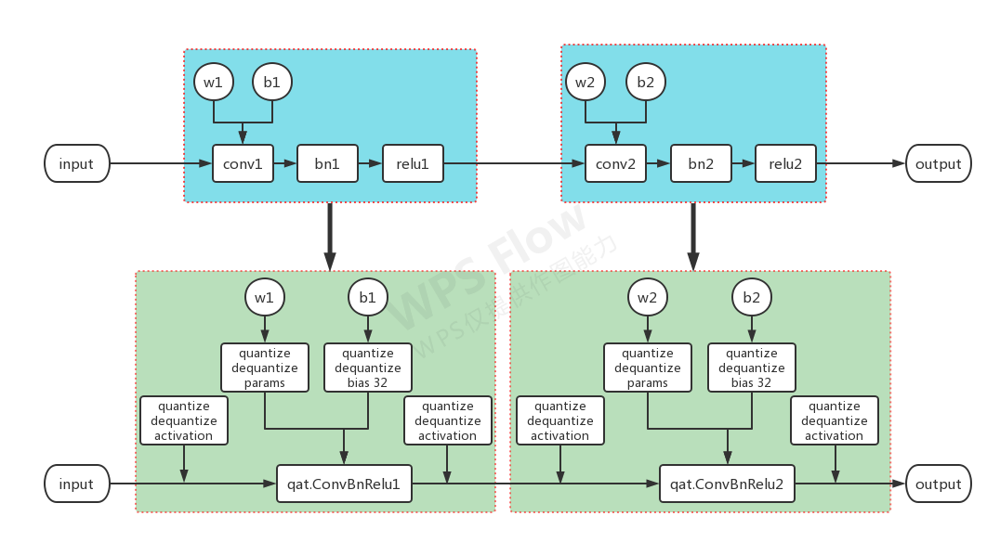

# pytorch-quantization-demo (https://github.com/Jermmy/pytorch-quantization-demo)

## 基本简介

来自商汤员工，Jermmy(输出了很多高质量的量化方向[文章](https://zhuanlan.zhihu.com/c_1258047709686231040))

支持PTQ和QAT

支持qp参数保存

提供底层节点来完成量化节点的替换

示例及其简洁，用于学习入门非常好

支持节点比较少，如果要完整应用还要增加算子

## 节点替换

```python
class NetBN(nn.Module):

    def __init__(self, num_channels=1):
        super(NetBN, self).__init__()
        self.conv1 = nn.Conv2d(num_channels, 40, 3, 1)
        self.bn1 = nn.BatchNorm2d(40)
        self.conv2 = nn.Conv2d(40, 40, 3, 1)
        self.bn2 = nn.BatchNorm2d(40)
        self.fc = nn.Linear(5 * 5 * 40, 10)

    def forward(self, x):
        x = self.conv1(x)
        x = self.bn1(x)
        x = F.relu(x)
        x = F.max_pool2d(x, 2, 2)
        x = self.conv2(x)
        x = self.bn2(x)
        x = F.relu(x)
        x = F.max_pool2d(x, 2, 2)
        x = x.view(-1, 5 * 5 * 40)
        x = self.fc(x)
        return x

    def quantize(self, num_bits=8):
        self.qconv1 = QConvBNReLU(self.conv1, self.bn1, qi=True, qo=True, num_bits=num_bits)
        self.qmaxpool2d_1 = QMaxPooling2d(kernel_size=2, stride=2, padding=0)
        self.qconv2 = QConvBNReLU(self.conv2, self.bn2, qi=False, qo=True, num_bits=num_bits)
        self.qmaxpool2d_2 = QMaxPooling2d(kernel_size=2, stride=2, padding=0)
        self.qfc = QLinear(self.fc, qi=False, qo=True, num_bits=num_bits)

    def quantize_forward(self, x):
        x = self.qconv1(x)
        x = self.qmaxpool2d_1(x)
        x = self.qconv2(x)
        x = self.qmaxpool2d_2(x)
        x = x.view(-1, 5*5*40)
        x = self.qfc(x)
        return x

    def freeze(self):
        self.qconv1.freeze()
        self.qmaxpool2d_1.freeze(self.qconv1.qo)
        self.qconv2.freeze(qi=self.qconv1.qo)
        self.qmaxpool2d_2.freeze(self.qconv2.qo)
        self.qfc.freeze(qi=self.qconv2.qo)

    def quantize_inference(self, x):
        qx = self.qconv1.qi.quantize_tensor(x)
        qx = self.qconv1.quantize_inference(qx)
        qx = self.qmaxpool2d_1.quantize_inference(qx)
        qx = self.qconv2.quantize_inference(qx)
        qx = self.qmaxpool2d_2.quantize_inference(qx)
        qx = qx.view(-1, 5*5*40)

        qx = self.qfc.quantize_inference(qx)
        
        out = self.qfc.qo.dequantize_tensor(qx)
        return out

```

```python
class QConvBNReLU(QModule):

    def forward(self, x):

        if hasattr(self, 'qi'):
            self.qi.update(x)
            x = FakeQuantize.apply(x, self.qi)

        if self.training:
            y = F.conv2d(x, self.conv_module.weight, self.conv_module.bias, 
                            stride=self.conv_module.stride,
                            padding=self.conv_module.padding,
                            dilation=self.conv_module.dilation,
                            groups=self.conv_module.groups)
            y = y.permute(1, 0, 2, 3) # NCHW -> CNHW
            y = y.contiguous().view(self.conv_module.out_channels, -1) # CNHW -> C,NHW
            # mean = y.mean(1)
            # var = y.var(1)
            mean = y.mean(1).detach()
            var = y.var(1).detach()
            self.bn_module.running_mean = \
                self.bn_module.momentum * self.bn_module.running_mean + \
                (1 - self.bn_module.momentum) * mean
            self.bn_module.running_var = \
                self.bn_module.momentum * self.bn_module.running_var + \
                (1 - self.bn_module.momentum) * var
        else:
            mean = Variable(self.bn_module.running_mean)
            var = Variable(self.bn_module.running_var)

        std = torch.sqrt(var + self.bn_module.eps)

        weight, bias = self.fold_bn(mean, std)

        self.qw.update(weight.data)

        x = F.conv2d(x, FakeQuantize.apply(weight, self.qw), bias, 
                stride=self.conv_module.stride,
                padding=self.conv_module.padding, dilation=self.conv_module.dilation, 
                groups=self.conv_module.groups)

        x = F.relu(x)

        if hasattr(self, 'qo'):
            self.qo.update(x)
            x = FakeQuantize.apply(x, self.qo)

        return x
```

```python
QParam -> 
def quantize_tensor(x, scale, zero_point, num_bits=8, signed=False):
    if signed:
        qmin = - 2. ** (num_bits - 1)
        qmax = 2. ** (num_bits - 1) - 1
    else:
        qmin = 0.
        qmax = 2. ** num_bits - 1.
 
    q_x = zero_point + x / scale
    q_x.clamp_(qmin, qmax).round_()
    
    return q_x
 
def dequantize_tensor(q_x, scale, zero_point):
    return scale * (q_x - zero_point)
```

替换属于简洁暴力的操作，直接写死了替换原则

节点的forward比较清晰，按照qdq->forward->qdq进行了完整演示，附带类似fold bn操作，量化参数统计操作都比较清晰

替换完成的节点类似

