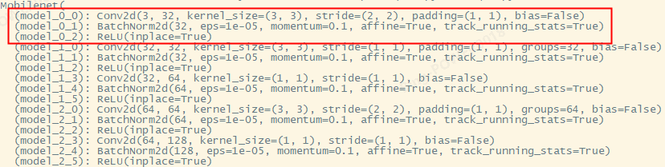
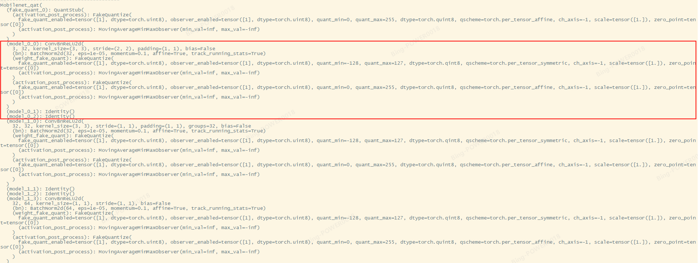
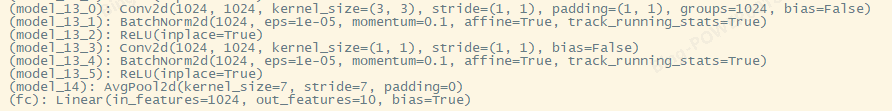
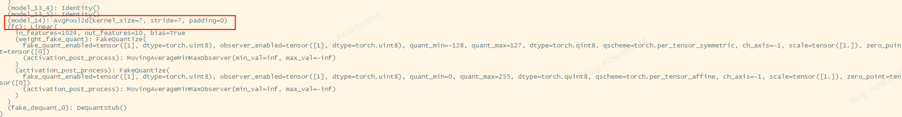
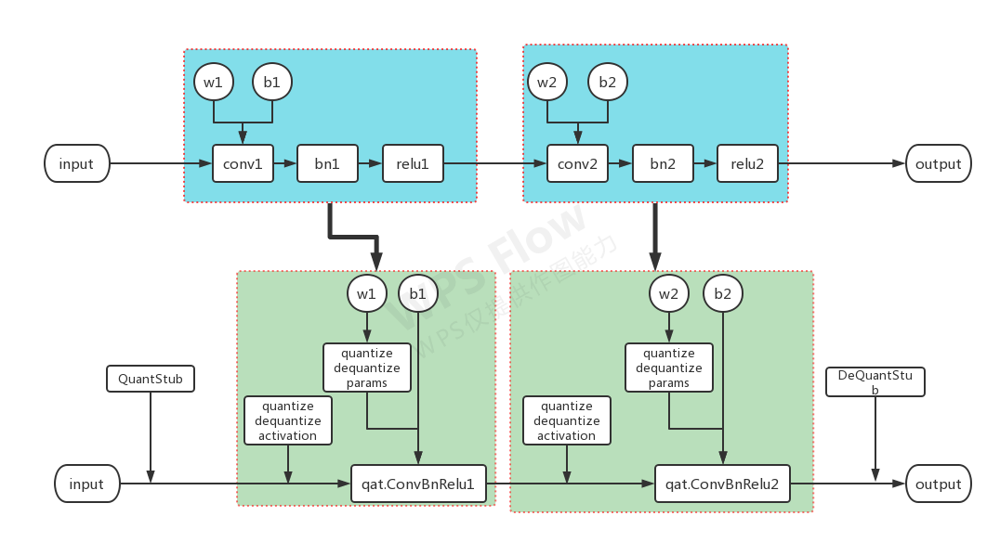

# TinyNeuralNetwork (https://github.com/alibaba/TinyNeuralNetwork)

## 基本简介

来自阿里巴巴，结构追踪，剪枝，量化，模型转换(to tflite)

实现了Graph Tracer，有点类型最新的torch.fx能力，但是有所增强

基于追踪可以逆向生成model.py文件

依赖分析，算子和算子，图和图依赖等，能自动实现图修改

QAT**使用Pytorch的QAT作为后端**，扩展支持BF16，能自动完成算子融合，但是支持的算子多少就要看pytorch支持多少了，要求Pytorch 1.6+

自动追踪不支持控制流，例如经常出现的
```python
def forward(x):
    x = conv(x)
    if slef.is_training:
        y = l2(x)
        return y
    return x
```
输入需要是Pytorch的Tensor

## Pytorch和TinyNeuralNetWork的量化流程

PyTorch量化流程
- 修改模型的forward函数，插入QuantStub、DeQuantStub
- 手动将模型中的所有add、mul、cat等操作替换为torch.nn.quantized.FloatFunctional，例如forward函数中的代码行x = a + b，需要创建一个对应的算子 self.add0 = torch.nn.quantized.FloatFunctional() 然后在forward函数中调用 x = self.add0.add(a, b)
- 编写fuse_model函数，手动进行算子的融合例如相邻的Conv2D、BatchNorm2D需要融合为ConvBN2D （越复杂的模型这一步操作也越复杂，尤其是一些网状结构，工作量惊人）
- 调用prepare_qat将计算图转换为量化计算图（官方接口这一步是全图量化，对于混合精度量化需要自己魔改或者拆分模型才能支持）
- 量化后的模型只能转为TorchScript，无法转为ONNX、TFLite等常见的端上结构导致难以部署

TinyNeuralNetwork量化流程
- 基于用户提供的模型代码，codegen一份新的代码（等价于上述的步骤1，步骤2）
- 提供更智能的prepare_qat函数，内部自动完成计算图的算子融合，以及混合精度的分析（等价于上述步骤3， 4）
- 提供TorchScript到TFLite的转换（支持浮点、量化模型），简化端上部署

```
上面的torch流程在使用torch.fx之后实际可以简化到类似TinyNeuralNetwork的流程
```

## 代码使用示例

```python
import torch
import torchvision

from tinynn.graph.tracer import model_tracer, trace

with model_tracer():
    # 模型准备
    model = torchvision.models.alexnet()
    model.eval()

    # 提供一个可用的输入
    dummy_input = torch.rand((1, 3, 224, 224))

    # 通过trace，我们可以拿到计算图
    graph = trace(model, dummy_input)

    # 基于计算图，可以生成一份模型的描述代码
    graph.generate_code(f'my_alexnet.py', f'my_alexnet.pth', 'Alexnet')
```

实际qat操作







简化图如下


由此可以看出基本操作流程，以及可能有不支持的算子出现

