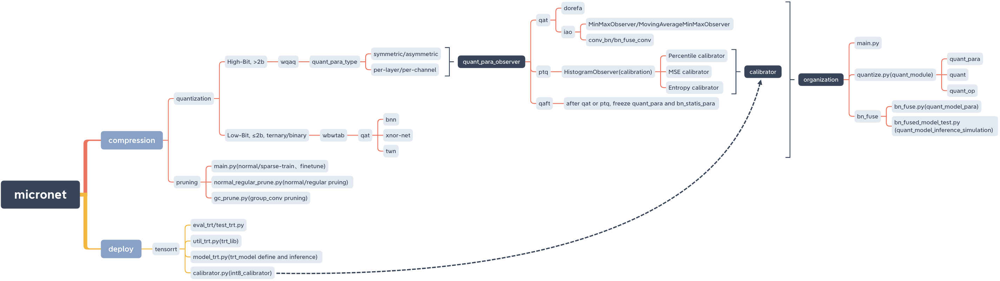
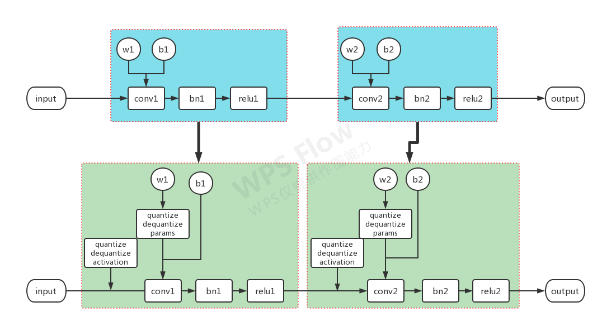

# micronet (https://github.com/666DZY666/micronet)

## 基本简介

首先区分下这是一个压缩，量化的工程。不是 [MicroNet: Towards Image Recognition with Extremely Low FLOPs](https://arxiv.org/abs/2011.12289) 后者是一种高效的网络结构

不过这两者都有一个共同的目标就是将模型应用到移动端(低算力平台)

来自北大的一位大佬，貌似属于个人学习项目，支持量化(PTQ+QAT)，压缩

代码目录如下


QAT操作由**提供基础**算子来支持，Pytorch要求版本不高≥1.1即可

基础算子例如 QuantConv2d ，包含ActivationQuantizer，WeightQuantizer。计算由F.conv2d来完成

常规构建模型，然后通过quantize->prepare递归的完成支持节点的替换

```python
if isinstance(child, nn.Conv2d):
    layer_counter[0] += 1
    if layer_counter[0] > 1:
        if child.bias is not None:
            quant_conv = QuantConv2d(
                child.in_channels,
                child.out_channels,
                child.kernel_size,
                stride=child.stride,
                padding=child.padding,
                dilation=child.dilation,
                groups=child.groups,
                bias=True,
                padding_mode=child.padding_mode,
                a_bits=a_bits,
                w_bits=w_bits,
                quant_inference=quant_inference,
            )
            quant_conv.bias.data = child.bias
        else:
            quant_conv = QuantConv2d(
                child.in_channels,
                child.out_channels,
                child.kernel_size,
                stride=child.stride,
                padding=child.padding,
                dilation=child.dilation,
                groups=child.groups,
                bias=False,
                padding_mode=child.padding_mode,
                a_bits=a_bits,
                w_bits=w_bits,
                quant_inference=quant_inference,
            )
        quant_conv.weight.data = child.weight
        module._modules[name] = quant_conv
```

```python
class QuantConv2d(nn.Conv2d):
    def __init__(
        self,
        in_channels,
        out_channels,
        kernel_size,
        stride=1,
        padding=0,
        dilation=1,
        groups=1,
        bias=True,
        padding_mode="zeros",
        a_bits=8,
        w_bits=8,
        quant_inference=False,
    ):
        super(QuantConv2d, self).__init__(
            in_channels,
            out_channels,
            kernel_size,
            stride,
            padding,
            dilation,
            groups,
            bias,
            padding_mode,
        )
        self.quant_inference = quant_inference
        self.activation_quantizer = ActivationQuantizer(a_bits=a_bits)
        self.weight_quantizer = WeightQuantizer(w_bits=w_bits)

    def forward(self, input):
        quant_input = self.activation_quantizer(input)
        if not self.quant_inference:
            quant_weight = self.weight_quantizer(self.weight)
        else:
            quant_weight = self.weight
        output = F.conv2d(
            quant_input,
            quant_weight,
            self.bias,
            self.stride,
            self.padding,
            self.dilation,
            self.groups,
        )
        return output
```

不会统计量化信息，也不会导出量化信息，属于跑完就测



## 优缺点
- 支持会更灵活，混合精度，算子融合等
- 导出信息更方便
- 代码侵入程度过高，约等于重新定义网络
- 现有算子很少，要完整支持所有网络，需要支持较多的算子
